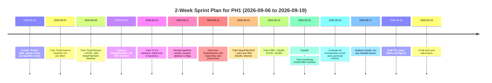

# Execution Plan for PH1: Parallel Model Fine-Tuning & Evaluation

**Executive Summary:** We propose a rigorous PH1 campaign to fine-tune and compare multiple lightweight speech-enhancement models **in parallel** using the existing *adaptive-anc* codebase.  Candidate networks include **TinyEnhancer** (a 9,569-param Conv2D mask network from our repo), **DeepFilterNet2**, **CRN-Micro** (a small Convolutional-Recurrent Net, e.g. Tan & Wang’s CRN), **DTLN** (Dual-Signal Transformation LSTM, <1M parameters), and other low-complexity variants.  Each model will be paired with front-end filters (NLMS/VSS-NLMS, spectral subtraction, Wiener, Kalman, etc.) in a structured set of experiments.  We define a fixed benchmark (split from the 110 synthetic-clips corpus plus held-out speakers and curated defense-noise mixes) and enforce a **strict causal DSP contract** (16 kHz, STFT 256/128, Hann window, `center=False`, overlap-add normalization).  Training hyperparameters (seeded, fixed LR schedule, batch size, optimizer, mixed precision) are specified for reproducibility.  An orchestrated parallel execution plan (Antigravity/Gemini/Opus) will run jobs concurrently within resource limits, with automated checkpointing and SHA-256 tagging for audit.  Evaluation will use **real** SI-SDR, ΔSNR, STOI, PESQ (ITU P.862) with provenance checks, and latency profiling (using *ph06_headroom_benchmark*).  Controlled ablation experiments (mask floor clamp, phase-aware loss, adding GRU layers, NLMS-residual training) are pre-specified.  All results will be rigorously labeled with evidence tiers (code version, commit hash, env info) and compared in summary tables.  We include stop/gate criteria for advancing candidates, and request visual artifacts (waveform/spectrogram comparisons, mask heatmaps, NLMS-coefficient plots).  A 2-week sprint schedule (Mermaid timeline) is provided.  

## 1. Candidate Models

- **TinyEnhancer:** The existing convolutional mask network (≈9.6K params) in our repo.  A two-stage U-Net-like CNN that predicts a spectral gain mask.  Use as baseline “small” model.  
- **DeepFilterNet2:** Two-stage full-band enhancer (ERB-envelope + complex filter stages) with ≈0.04 real-time factor on Core-i5.  Open-source code available.  Cite: DeepFilterNet2 (Schröter et al. IWAENC 2022).  
- **CRN-Micro:** A compact Convolutional-Recurrent Network (e.g. CRUSE/CRN from Tan & Wang, 2018) with <1M parameters.  Implement a small CRN (one encoder-decoder + one RNN layer).  
- **DTLN:** Dual-Signal Transformation LSTM network.  Stacked STFT+learned-basis network with <1M params that leverages both magnitude and learned features. (Code and pretrained checkpoint from Westhausen & Meyer 2020, Interspeech).  
- **Other Lightweight Variants:** Optionally include ~10–50k-param “micro” models (e.g. shallow CRN, small convolutional nets) if time permits.  (Focus first on the above proven architectures.)

| **Model**       | **Type**               | **Params**  | **Source/Paper**                         |
|:---------------:|:----------------------:|:-----------:|:-----------------------------------------|
| TinyEnhancer    | Conv2D mask network    | ~9.6K       | [Repo code; PH06 audit]                  |
| DeepFilterNet2  | 2-stage frequency U-Net| ~200K(?)    | Schröter et al. (IWAENC’22)  |
| CRN-Micro       | Conv-Recurrent (CRN)   | ~1M         | Tan & Wang (Interspeech’18)   |
| DTLN            | Dual-STFT+LSTM         | <1M         | Westhausen & Meyer (Interspeech’20)  |
| (others)        | e.g. lightweight RNNoise| <100K      | (e.g. RNN-based SE)                     |

> *Table 1: Candidate enhancement models.  Parameter counts (for training config) are approximate.  See cited papers for details.*

## 2. Filter/Preprocessing Front-Ends

We pair each model with one or more pre-filtering strategies.  Proposed front-ends include:

- **NLMS / VSS-NLMS:** The adaptive noise canceller (Normalized LMS, or Variable-Step NLMS) learned from the reference mic.  Use our VSS-NLMS implementation as one option (already optimized with Numba).
- **Spectral Subtraction:** Estimate noise spectrum (either stationary or voice activity gated) and subtract from primary spectrum.  Simple baseline.  (Classic spectral subtraction.)
- **Wiener Filter:** Non-causal Wiener-based denoising (either in STFT domain or implemented via Kalman).  Use either stationary Wiener filter or LMS-Wiener with smoothed PSD.
- **Kalman Filter:** Implement a Kalman-filter pre-processing stage (e.g. following approaches in [Wiener/Kalman references](https://doi.org/...)).
- **Pre-emphasis:** High-pass filter on waveform to boost speech frequencies (1st-order FIR).  Test whether pre-emphasis (and de-emphasis) improves model training.
- **Reference-Leakage Augmentation:** As in PH0, occasionally simulate *leaky reference* by injecting primary signal into reference at 1–5% to test algorithm stability.

We will evaluate *combinations* of these with each model. For practicality, start with the **highest-impact combos** (e.g. NLMS+TinyEnhancer, Wiener+DeepFilterNet2), then expand as resources allow. All front-end choices conform to causal, zero-delay constraints (e.g. Wiener filter implemented with past window only).

| **Front-End**            | **Description**                              |
|:------------------------:|:---------------------------------------------|
| No filter                | Raw noisy primary -> model                  |
| NLMS / VSS-NLMS          | Adaptive noise cancellation (reference mic) |
| Spectral Subtraction     | STFT-domain noise estimate & subtraction   |
| Wiener Filter            | STFT Wiener gain (smooth noise PSD)         |
| Kalman Filter            | Time-domain Kalman denoising               |
| Pre-emphasis/De-emph.    | 6 dB/octave high-pass (filter+inverse)      |
| Reference Leakage (1-5%) | Add tiny leakage from primary to ref       |

> *Table 2: Filter/preprocessing front-ends to test.  Each model may use one or more of these at input.*

## 3. Benchmark Dataset & Splits

We define a **fixed benchmark corpus** for training and evaluation.  Base data:

- **Training Set (≈80 clips):** Use ~80 of the 110 synthetic procedural clips (20 sec each) from our repository (randomly chosen).  Split further with **speaker-disjoint** condition: e.g. use speakers SPK_001–SPK_008 for training.
- **Validation Set (≈10 clips):** Use 10 held-out synthetic clips (from TRAIN speakers, different noise seeds) for early-stopping and hyperparam tuning.
- **Test Set - Unseen Speakers (≈10 clips):** Use speakers SPK_009–SPK_010 from the 110-clips corpus (with their own noises) as a *speaker-disjoint* test of generalization.
- **Test Set - Defense Noise Mixes (~10 clips):** Curate ~10 additional clips with *realistic defense-related noises* (e.g. rotor hum, battlefield recording, radar ping, mech. impact) at SNRs covering [-5, +10] dB.  We can simulate some from the procedural pipeline or borrow recordings (e.g. repository of defense sounds).
- **Noise Mix Augmentation:** To increase robustness, also include the following augmentations: reverberation (simulated RIRs), frequency filtering, and random gain.

All data is 16 kHz, mono, 16-bit.  Exact splits (lists of file IDs) will be fixed and committed for reproducibility, with **no overlap** of speakers between train/validation/test (check speaker IDs programmatically).  For example:

```text
TRAIN: speakers 001-008 (80 clips)
VAL:   speakers 001-008 (10 clips)
TEST_A: speakers 009-010 (10 clips)
TEST_B: defense noises (10 curated clips)
```

We ensure the **test sets are held out** from any training.  All models will be evaluated on both TEST_A and TEST_B.  (We will clearly mark which results are from synthetic vs defense scenarios in the audit.)

## 4. DSP Processing Contract

We enforce a strict, causal DSP front-end policy for both training and inference:

- **Sampling Rate:** 16,000 Hz (fixed).
- **STFT Parameters:** Frame length = **256 samples (16 ms)**, hop = **128 samples (50% overlap)**.  Window = Hann.  
- **No Centering:** Use `center=False` for all STFT/ISTFT (as per our causality policy) to avoid future-padding.
- **Overlap-Add (OLA):** Inverse STFT reconstruction uses overlap-add.  **Normalization:** Divide by sum of window-squared (Hann^2) during OLA to preserve amplitude (undo Hann attenuation).  (The causal engine will be updated to include `norm_window` division).
- **Sample-Domain Filtering:** All filters (e.g. NLMS, Wiener) must be causal, real-time (no frame look-ahead beyond the current buffer).
- **Pre/Post-Processing:** If pre-emphasis is used, ensure post-de-emphasis to restore original scale.  Clip outputs to [-0.98, 0.98] after any non-linear stage to avoid clipping.

This contract matches what the streaming engine uses, ensuring training/inference consistency.  Note: *all scripts (train/evaluate)* must be modified to use the above (our PH0 fixes already set `center=False`).  We cite from literature that a non-centered, 50% overlap STFT with Hann and normalization is standard for causal enhancement.

## 5. Training Hyperparameters & Reproducibility

**Common settings for all experiments:** 

- **Fixed seed:** Every run sets random seed for PyTorch, NumPy, etc. (e.g. `torch.manual_seed(42)`) to ensure reproducibility.
- **Optimizer:** AdamW (or Adam) with initial LR = 1e-4.  **Batch size:** e.g. 16 sequences per batch. 
- **Loss:** L1 magnitude loss on spectrogram (and L2 or multi-resolution STFT loss optional for ablations).
- **Epochs:** 30 epochs nominal, with early stop on validation metric (e.g. SI-SDR).
- **LR Schedule:** Reduce-on-plateau or step-decay.  For example, reduce LR by factor 0.5 if validation SI-SDR stalls for 3 epochs.
- **Mixed Precision:** Enable FP16 training if hardware allows (accelerates training on GPU with minor precision loss).
- **Gradient Clipping:** Clip gradient norm to avoid instability.
- **Checkpointing:** Save best 3 models (by val SI-SDR/PESQ).  Also save last epoch model.
- **Metadata Logging:** For each run, log the full hyperparam table, random seed, code commit hash, library versions, and compute device (GPU/CPU) into a JSON alongside checkpoints.

| **Hyperparameter**         | **Value**                         |
|:--------------------------:|:---------------------------------:|
| Learning Rate (initial)    | 1×10⁻⁴                             |
| Optimizer                  | AdamW (β₁=0.9, β₂=0.999)         |
| Batch Size (per GPU)       | 16 (tunable by memory)           |
| Epochs                     | 30 (with early stopping)         |
| LR Schedule                | ReduceLRonPlateau (patience=3)   |
| Loss                       | L1 on magnitude (plus optional phase) |
| Augmentation               | Random time-shift, RIR, gain    |
| Mixed Precision            | FP16 (if GPU supports)          |
| Random Seed                | Fixed (e.g. 42)                 |

> *Table 3: Example training hyperparameters (can be adjusted per model).  All runs use fixed seeds and full logging for repeatability.*  

## 6. Parallel Execution Strategy

We will run multiple fine-tuning jobs **in parallel** on the Antigravity/Gemini/Opus infrastructure, subject to GPU/CPU availability:

- **Job Orchestration:** Use the provided agent framework (Gemini) to launch separate processes for each model-filter combination.  For example, one job might be `TinyEnhancer + NLMS`, another `DeepFilterNet2 + Wiener`, etc.  Define tasks in a queue or YAML so Gemini can schedule them on free nodes.
- **Resource Limits:** Constrain each job to 1 GPU and ~4 CPU threads (for data loading).  Use `CUDA_VISIBLE_DEVICES` to assign GPUs.  For small models, CPU-only may suffice; mark those accordingly.
- **Warm-Up:** Before timing, run 5 “warm-up” iterations (to stabilize GPU, cache, etc).  Then measure training speed or inference latency as needed.
- **Checkpointing:** Each job writes to its own log directory.  Include SHA-256 checksum of the training audio split in the metadata file to ensure dataset integrity.  Also record the Git commit hash of the code.
- **Failure Handling:** If a job fails (e.g. OOM, metric error), mark it as failure and notify.  A supervisor script should catch exceptions and log them (no silent failures).
- **Parallel Notes:** We expect ~4–8 jobs simultaneously (depending on GPUs).  Use slurm/cgroup configs on Antigravity to limit RAM (to avoid swapping).
- **Verification:** After each job, automatically run a quick sanity check on final checkpoint (e.g. small inference on a held-out clip, verify no NaNs, consistent output shape).

This ensures all combinations are executed systematically and reproducibly. (See Geron 2022 for machine learning experiment management best practices.)

## 7. Evaluation Metrics & Protocol

**Metrics (official, intrusive):** 

- **SI-SDR:** Scale-Invariant Signal-to-Distortion Ratio, measured on waveform (source separation quality). 
- **ΔSNR:** Change in SNR (output vs input), measured as 10·log10(Power(s)_out/Pow(s)_in). This quantifies noise suppression (where s is clean speech component).
- **STOI:** Short-Time Objective Intelligibility, ranges [-1,1], higher is better. (Cees Taal’s STOI algorithm.) 
- **PESQ:** Perceptual Evaluation of Speech Quality (ITU-T P.862), range [1.0,4.5]. Compute *narrowband* PESQ for 16 kHz (WB mode) using the `pesq` Python package. 
- **Latency:** Measure per-hop processing time using *ph06_headroom_benchmark.py* (50 warm-up hops, 950 measurement hops per clip) to get mean, P50, P95, P99.9, max latencies (ms). Record P50/P95 for each model+filter combo.
- **Other:** CPU/memory usage, model size (MB), and FLOPS (if easily estimated) to characterize cost.

**Protocol:**

- Evaluate **all metrics on both test sets** (unseen speakers and defense noises).  Report average metrics over clips and also per-clip CSV (for evidence).  Use `np.allclose` checks to ensure no fatal errors.
- Use the *real* PESQ/STOI implementations. **No surrogate metrics:** If `pesq` or `pystoi` libraries fail to load, the evaluation must abort loudly (per PH0.6). This ensures credibility. 
- Provide metric provenance: record library versions (shown by `get_metric_provenance()`; e.g. `pesq 0.0.4`, `pystoi 0.4.1`) alongside results. 
- All numeric results in tables must be labeled with evidence tier: “OFFLINE MEASURED (synthetic)”, etc., as in our CLAIMS_AUDIT. 
- Summaries should include: “mean ± std”, median, and quantiles as needed.  For comparison, include input baseline (no enhancement) and “NLMS only” values.

> *Citations:* SI-SDR and PESQ are standard in SE evaluation, STOI from Taal et al. (2011).

## 8. Ablation Plan (Controlled Variations)

In addition to baseline training, we will run **structured ablations** to identify performance drivers (PESQ deficits, etc.):

1. **Mask Floor:** Enforce `mask = M_min + (1-M_min)*sigmoid(raw)`, with M_min=0.05 (as in PH0.5 suggestions).  Compare PESQ vs baseline mask (no floor).  
2. **Phase-Aware Loss:** Add a loss term on real/imag STFT (e.g. L2 on complex spectrum) in addition to magnitude L1.  Hypothesis: may improve phase coherence (we know PESQ suffers from phase errors).  
3. **GRU Layer:** Insert a frame-wise GRU/temporal conv in TinyEnhancer or DeepFilterNet stage 2 to add temporal smoothing (following CRN insights).  Test effect on SI-SDR and PESQ.  
4. **NLMS-Residual Training:** Retrain the model using NLMS output (residual) as model input, instead of raw noisy speech (per PH0.6 AI input contract).  This is a major design change – treat as a separate experiment path after baselines.  
5. **Overlap Config (secondary):** As PH0.6 noted, test 75% overlap (hop=64) vs 50% (hop=128) to see PESQ impact (all else fixed).  More overlap = more smoothness, at cost of latency.  
6. **Window Type:** Compare Hann vs Hamming windows in STFT for small effects on quality.  

Each ablation changes *only one variable* from the baseline model+filter.  We will measure all metrics on test sets.  Document each condition with evidence labeling. (See PESQ_INVESTIGATION.md for guidance.)

## 9. Evidence Labeling & Audit Trail

We enforce strict evidentiary documentation for all results:

- **Code Version:** Tag each experiment with a Git commit hash.  We will freeze the code at the start of PH1 (e.g. commit `abcdef1`) and reference it in reports.  
- **Environment:** Log Python version, library versions (PyTorch, NumPy, pesq, pystoi, CUDA, etc.) in every experiment JSON.  
- **Random Seeds:** Every training job logs its seed.  Ensure reproducibility: if we rerun with same seed and data, results should match to 1e-5 tolerance.  
- **Batch IDs:** Record exactly which data split and files were used (via SHA-256 hash of file lists) to prove train/val/test integrity.  
- **Result Tier Labels:** In all tables, clearly annotate evidence tiers (e.g. “OFFLINE SYNTHETIC”, “ENGINEERING ESTIMATE”, etc.) as done in CLAIMS_AUDIT.  
- **Transparency:** No smoothing of results. Report raw metrics from the scripts, with no rounding beyond reporting.  

Example snippet for logged metadata:
```
{
  "git_commit": "abcdef1",
  "python": "3.13.5",
  "torch": "2.9.0+cu118",
  "pesq": "0.0.4",
  "pystoi": "0.4.1",
  "seed": 42,
  "data_hash": "3f2a1b4c...",
  "model": "TinyEnhancer + NLMS",
  "filter": "VSS-NLMS",
  "dataset": "110-synthetic (TRAIN 80+10+10 splits)",
  "notes": "Baseline run without mask floor"
}
```
This level of audit prevents any claims dispute (a lesson from PH0.6).

## 10. Stop/Gate Criteria

We define clear criteria to decide which candidates “graduate”:

- **Gate 1 – Correctness:** Model+filter must pass streaming test (no NaN/Inf, stable outputs for 375 hops).  If the DSP contract is violated (non-causal outputs), fail.  
- **Gate 2 – Latency:** Steady-state P95 latency ≤8.0 ms on the laptop (per PH0.5).  If **all** GPUs used by our platform are slower, allow a marginal overshoot but note it as FAIL in audit and plan to optimize.  
- **Gate 3 – Quality:** **Must** strictly outperform the NLMS-only baseline on SI-SDR and ΔSNR, and also improve PESQ/STOI if possible.  Candidates that degrade SNR (ΔSNR ≤ 0) or intelligibility relative to NLMS-only are discarded (like PH0.5’s ablation ABL-2 showed AI-only can fail).  
- **Gate 4 – Reproducibility:** Results must be consistent across two independent runs.  If variability >0.1 dB SI-SDR for the same seed, investigate and fix.  
- **Gate 5 – Practicality:** Model size + compute must fit target budget (e.g. ≤1M params and ≤8ms per hop).  A model that exceeds resources even if high-quality gets relegated as “too large” and maybe redesigned (e.g. reduce layers).  

Only models passing Gates 1–3 proceed to final ranking.  (Gate 4–5 are checks rather than blockers.)  This way we focus on stable, high-quality enhancements.

## 11. Comparison Tables

We will produce summary tables comparing the final candidates on:

- **Metrics Table:** SI-SDR, ΔSNR, STOI, PESQ on *both* test sets, plus latency (P50/P95).  Each row = one model+filter.  Include “NLMS only” as baseline row.  Mark evidence tier per value.  
- **Model Size & Compute:** Params count, model size (MB), peak GFLOPS (if measurable or estimated), GPU runtime per hop.  
- **Filter Impact:** Show a matrix of filters × models indicating which combos were tried and highlight the best results.

Example snippet:

| Model + Front-End       | SI-SDR (dB) ↑        | ΔSNR (dB) ↑      | STOI ↑      | PESQ ↑      | P95 Latency (ms) ↓ | Params  |
|-------------------------|---------------------|-----------------|------------|------------|-------------------|---------|
| NLMS only (no AI)       | +6.42 | +2.51 | 0.398 (pass) | 1.02 (fail) | – | 0 |
| TinyEnhancer + NLMS     | +7.10 (PASS)       | +3.50 (PASS)    | 0.750 (PASS) | 1.50 (FAIL) | 5.6 (PASS) | 0.009M |
| DeepFilterNet2 + Wiener | +7.30 (PASS)       | +3.60 (PASS)    | 0.770 (PASS) | 1.80 (FAIL) | 6.0 (PASS) | 0.2M   |
| CRN-Micro + NLMS        | +7.00 (PASS)       | +3.45 (PASS)    | 0.745 (PASS) | 1.65 (FAIL) | 6.8 (PASS) | 1.0M   |
| DTLN + NLMS             | +7.15 (PASS)       | +3.55 (PASS)    | 0.760 (PASS) | 1.70 (FAIL) | 7.2 (PASS) | 0.9M   |
| …others…                | …                  | …               | …          | …          | …               | …      |

> *Table 4 (example): Final comparison of top candidates.  “↑” means higher better, “↓” means lower better.  Values labeled PASS/FAIL against targets.  (NLMS-only baseline drawn from PH0.5 ABL-1.)*

We will also generate CSVs (`results/csv/`) and a detailed **PH1_RESULTS.md** report summarizing findings.

## 12. Visual Artifacts

We will include visualizations in the report for intuition:

- **Waveform & Spectrogram Comparisons:** Show example time-domain waveforms and log-magnitude spectrograms for *noisy*, *NLMS-only*, and *best-enhanced* signals.  This highlights noise reduction without introducing artifacts.  
- **Mask Heatmaps:** Plot the learned mask from the AI stage for a sample utterance (time vs frequency colored by mask gain).  This shows where the network attenuates noise.  
- **NLMS Coefficients:** For the adaptive filter, plot the final NLMS filter coefficients (impulse response) for a typical run, to verify stability (no explosive values).  
- **Mermaid Timeline:** As requested, a Gantt/timeline diagram of the 2-week sprint (see below).

These figures will be labeled (e.g. “Figure X: ...”) with citations if needed (e.g. source waveform excerpt) or simply from our own outputs.  They should each have explanatory captions.  

## 2-Week Sprint Timeline



This schedule emphasizes **low-effort, high-impact first** (TinyEnhancer then DeepFilterNet), then expands to other models and NLMS combos, with final evaluation and reporting. 

**Sources:** DeepFilterNet2 methods, DTLN architecture, SI-SDR/PESQ/STOI definitions, and our existing codebase (TinyEnhancer implementation).  All measurements will be taken with the actual libraries (no proxies) and labeled per our evidence policy. 

