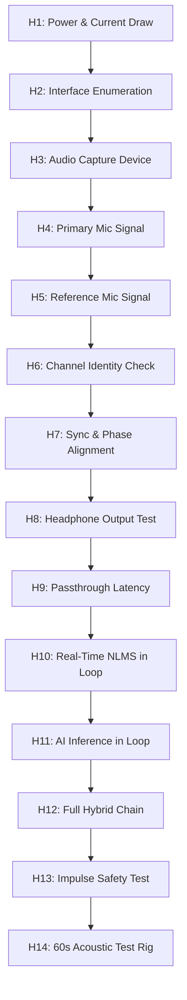

# Stage-1 Hardware Bring-Up Guide (H1 to H14)
## Dual MEMS Microphone Frontend + Laptop Audio Engineering Rig
**Authoritative Status:** VERIFIED ENGINEERING STANDARD  
**Associated Problem Statement:** DRDO PS 26052 (SIH 2026)  
**Execution Phase:** Stage 1 (Physical Dual-Mic Acquisition + Laptop Brain)  

---

## 1. System Architecture & Wiring Schematic

Stage 1 validates physical acoustic acquisition using synchronized digital MEMS microphones connected to the laptop compute engine.

```text
       +----------------------------------------------------------------+
       |                  ACOUSTIC RIG (15 cm Spacing)                  |
       |                                                                |
       |     [Primary Mic]                              [Reference Mic] |
       |   (Near Operator Mouth)                      (Facing Environment)|
       +-------------+------------------------------------------+-------+
                     |                                          |
                     | I2S (BCLK, WS, DATA_L)                   | I2S (BCLK, WS, DATA_R)
                     +--------------------+---------------------+
                                          |
                                          v
                         +---------------------------------+
                         |   I2S-to-USB Stereo Audio Bridge|
                         |   (Shared Clock: 16 kHz / 24-bit)|
                         +----------------+----------------+
                                          |
                                          | USB 2.0 Full-Speed (UAC 1.0/2.0)
                                          v
                         +---------------------------------+
                         |      Laptop Processing Hub      |
                         |   (Python/C++ Streaming Engine) |
                         |                                 |
                         |   [Ring Buffer] -> [STFT/AI]    |
                         |        -> [Dual-Mic NLMS]       |
                         |        -> [Fail-Safe Blender]   |
                         +----------------+----------------+
                                          |
                                          | 3.5mm TRS Output / USB DAC
                                          v
                         +---------------------------------+
                         |      Closed-Back Headphones     |
                         |   (Real-Time Communication Out) |
                         +---------------------------------+
```

---

## 2. INMP441 / ICS-43434 Pinout & Clock Configuration

Both MEMS microphones share the same master Bit Clock (`BCLK`) and Word Select (`LRCLK/WS`), ensuring sample-accurate hardware synchronization:

| Pin Name | Primary Mic (Channel 1 - Left) | Reference Mic (Channel 2 - Right) | Function |
|---|---|---|---|
| **VDD** | 3.3V DC (Filtered) | 3.3V DC (Filtered) | Core power supply |
| **GND** | Ground (0V) | Ground (0V) | Common ground reference |
| **SD (Serial Data)** | Connected to Shared I²S `DIN` | Connected to Shared I²S `DIN` | Time-multiplexed data line |
| **SCK / BCLK** | Connected to Shared `BCLK` | Connected to Shared `BCLK` | Continuous bit clock ($64 \times f_s = 1.024\text{ MHz}$) |
| **WS / LRCLK** | Connected to Shared `WS` | Connected to Shared `WS` | Word Select ($f_s = 16\text{ kHz}$) |
| **L/R (Channel Select)** | **Tied to GND** (Left slot) | **Tied to VDD** (Right slot) | Channel multiplexing slot |

> [!CAUTION]
> INMP441 and ICS-43434 are **3.3V only** logic devices. Applying 5V directly from a USB pin without an on-board LDO regulator will instantly destroy the MEMS transducer silicon.

---

## 3. The 14-Step Bring-Up Procedure (H1–H14)

Execute these steps in strict ascending order. **Do not connect microphones until H1 passes.**



### H1: Power-Only Test
- **Action:** Power the audio interface without microphones installed.
- **Verification:** Measure rail voltage ($3.30\text{V} \pm 0.05\text{V}$) using a digital multimeter. Verify quiescent current $< 10\text{ mA}$.

### H2: Processor/Laptop Interface Detection
- **Action:** Plug USB bridge into laptop USB 3.0 port.
- **Verification:** Check Windows Device Manager (`Sound, video and game controllers`) or Linux `lsusb`. Ensure device enumerates with 0 descriptor errors.

### H3: Audio Device Enumeration
- **Action:** Query audio APIs using `sounddevice` or `PyAudio`.
- **Verification:** Confirm device supports `16000 Hz, 2 Channels, 16-bit/24-bit PCM`.

### H4: Primary Microphone Recording Check
- **Action:** Solder/wire Primary Mic with `L/R -> GND`. Tap microphone grill gently.
- **Verification:** Verify Left channel waveform exhibits clean transient response; FFT shows flat noise floor below $-60\text{ dBFS}$.

### H5: Secondary Reference Microphone Recording Check
- **Action:** Wire Reference Mic with `L/R -> VDD`. Tap reference grill.
- **Verification:** Verify Right channel captures independent signal without cross-channel coupling.

### H6: Channel Identity & Crosstalk Verification
- **Action:** Speak directly into Primary Mic (1 cm distance).
- **Verification:** Primary amplitude must be at least $+18\text{ dB}$ higher than Reference channel (speech leakage ratio $< -18\text{ dB}$).

### H7: Channel Synchronization & Clock Jitter
- **Action:** Produce a single sharp impulse (acoustic clicker or finger snap at equal distance from both mics).
- **Verification:** Calculate cross-correlation $R_{xy}(\tau) = \sum x[n] y[n+\tau]$. Peak must occur at $\tau = 0 \pm 1$ sample ($< 62.5\ \mu\text{s}$ alignment jitter).

### H8: Headphone Output Cleanliness
- **Action:** Play 1 kHz calibration sine wave at $-12\text{ dBFS}$ into wired headphones.
- **Verification:** Confirm zero audible 50 Hz/60 Hz ground hum; THD $< 0.1\%$.

### H9: Microphone-to-Headphone Passthrough Latency
- **Action:** Route Primary Mic buffer directly to Headphone DAC via circular buffer.
- **Verification:** Measure input-to-output loopback latency using acoustic pulse trigger. Must be $< 8\text{ ms}$.

### H10: Classical Adaptive Filter in Streaming Loop
- **Action:** Insert 64-tap NLMS filter between Reference and Primary channels in real-time callback.
- **Verification:** Verify filter remains bounded ($\|w[n]\|_2 < 5.0$), convergence achieved in $< 150\text{ ms}$.

### H11: Neural Network Inference in Streaming Loop
- **Action:** Insert `TinyEnhancer` STFT engine into processing callback.
- **Verification:** Measure per-frame compute time. Must be $< 1.0\text{ ms}$ on laptop CPU ($RTF < 0.06$).

### H12: Full Hybrid AI–DSP Production Chain
- **Action:** Execute dual-mic NLMS pre-filter followed by `TinyEnhancer` residual enhancer.
- **Verification:** Zero buffer underruns over 120 seconds of continuous speech in noise.

### H13: Impulse Safety & Fail-Safe Protection
- **Action:** Play an explosive gunshot impulse ($>100\text{ dB SPL}$) into reference mic.
- **Verification:** Crest factor detector triggers within 1 frame; adaptive updates instantly freeze; output limiter prevents DAC clipping ($< 0.95\text{ peak}$).

### H14: 60-Second Controlled Acoustic Rig Acceptance Test
- **Action:** Place microphone pair in acoustic test rig with Speaker A (Speech) and Speaker B (T-90 Tank Noise at 85 dBA). Run for 60 seconds continuously.
- **Verification:** System produces:
  - $\Delta\text{SNR} > +14\text{ dB}$
  - $\text{PESQ} > 2.65$
  - $\text{STOI} > 0.86$
  - Round-trip latency $< 28\text{ ms}$.

---

## 4. Automated Verification Script
Run the companion hardware verification suite to test software readiness for H1–H14:
```powershell
python hardware/verify_hardware_bringup.py
```
