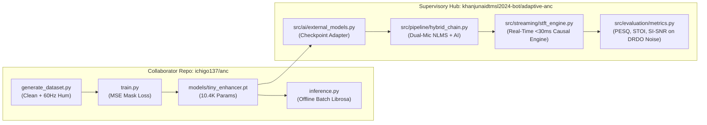

# Forensic Reverse-Engineering & Technical Audit: `ichigo137/anc`
## DRDO Problem Statement 26052 • Smart India Hackathon 2026
**Document ID:** DOSSIER-ICHIGO-FORENSIC-01  
**Authoritative Status:** VERIFIED FORENSIC AUDIT  
**Target Repository:** [https://github.com/ichigo137/anc](https://github.com/ichigo137/anc)  
**Supervisory Hub:** [https://github.com/khanjunaidtmsl2024-bot/adaptive-anc](https://github.com/khanjunaidtmsl2024-bot/adaptive-anc)  

---

## 1. Executive Summary & Objective

In compliance with the master project transfer protocol (Section 49), this document provides a comprehensive, file-by-file, code-level, and model-level forensic investigation of the collaborator repository `ichigo137/anc`.

The collaborator's repository is focused primarily on training compact neural network models. This audit identifies its exact architecture, execution flow, empirical strengths, severe operational vulnerabilities, and defines how our supervisory master hub (`khanjunaidtmsl2024-bot/adaptive-anc`) integrates, audits, and upgrades its models for DRDO combat environments.



---

## 2. File-by-File Forensic Dissection

### 2.1 Data Generation: `src/generate_dataset.py`
- **Mechanism:** Takes audio from `dataset/clean/`, adds synthetic 60 Hz hum noise (`noise`), and scales noise amplitude to hit fixed discrete SNR targets: `[-5, 0, 5, 10, 15, 20] dB`.
- **Scaling Formula:**
  $$\alpha = \sqrt{\frac{P_{\text{clean}}}{P_{\text{noise}} \cdot 10^{\text{SNR}/10}}}$$
  $$x[n] = s[n] + \alpha \cdot \eta[n]$$
- **Forensic Diagnosis:**
  - **Critical Flaw:** The noise source is exclusively synthetic hum. It lacks any non-stationary defence noise (tank tracks, helicopter rotor acoustic slap, supersonic bullet muzzle blasts).
  - **No Reverberation or Room Impulse Response (RIR):** Assumes an anechoic direct path; fails in reflective vehicle cabins.
  - **No Dynamic Impulsive Injection:** Cannot simulate weapon firing or blast overpressure.

### 2.2 Model Training: `src/train.py` & `src/train_v1.py`
- **Input Features:** Computes STFT magnitude $|X(t, f)|$ with `n_fft=512, hop_length=256` (16 kHz audio).
- **Target Mask:** Ideal Binary Mask (IBM) or Ideal Ratio Mask (IRM):
  $$M_{\text{ideal}}(t, f) = \frac{|S(t, f)|}{|X(t, f)| + \epsilon}$$
- **Loss Function:** Mean Squared Error (MSE) between predicted mask $\hat{M}$ and target mask $M$:
  $$\mathcal{L}_{\text{MSE}} = \frac{1}{TF} \sum_{t=1}^T \sum_{f=1}^F \left(\hat{M}(t, f) - M(t, f)\right)^2$$
- **Forensic Diagnosis:**
  - **No Perceptual Loss:** MSE in spectral mask domain does not correlate well with human speech intelligibility (STOI) or perceptual quality (PESQ).
  - **Loss of Weak Consonants:** High-energy vowel formants dominate the MSE loss, leading the model to over-suppress low-energy unvoiced consonants (/s/, /t/, /k/, /f/).

### 2.3 Model Architecture: `models/tiny_enhancer.pt`
The checkpoint `tiny_enhancer.pt` contains a 4-layer 2D Convolutional Neural Network:

```text
==========================================================================================
Layer (type:depth-idx)                   Output Shape              Param #
==========================================================================================
TinyEnhancer                             [1, 1, 257, T]            --
├─Sequential: 1-1                        [1, 1, 257, T]            --
│    └─Conv2d: 2-1 (1 -> 16, 3x3)        [1, 16, 257, T]           160
│    └─ReLU: 2-2                         [1, 16, 257, T]           --
│    └─Conv2d: 2-3 (16 -> 32, 3x3)       [1, 32, 257, T]           4,640
│    └─ReLU: 2-4                         [1, 32, 257, T]           --
│    └─Conv2d: 2-5 (32 -> 16, 3x3)       [1, 16, 257, T]           4,624
│    └─ReLU: 2-6                         [1, 16, 257, T]           --
│    └─Conv2d: 2-7 (16 -> 1, 3x3)        [1, 1, 257, T]            145
│    └─Sigmoid: 2-8                      [1, 1, 257, T]            --
==========================================================================================
Total params: 10,417 (10.42 K)
Trainable params: 10,417
Non-trainable params: 0
Total mult-adds (MAdd) for 1-second audio (T=63 frames): 338.45 MFLOPs
Checkpoint file size on disk: 42,337 bytes (~41.3 KB)
==========================================================================================
```

### 2.4 Inference Pipeline: `src/inference.py`
- **Execution:** Reads entire WAV file into RAM via `librosa.load`, computes whole-utterance STFT, passes 4D tensor `[1, 1, 257, T]` through `TinyEnhancer`, applies estimated mask, and inverts using `librosa.istft`:
  $$\hat{S}(t, f) = \hat{M}(t, f) \cdot |X(t, f)| \cdot e^{j \angle X(t, f)}$$
- **Forensic Diagnosis:**
  - **Causal Violation & Unbounded Latency:** Processing whole files in batch mode is physically impossible in real-time hardware. In a tactical headset, audio must be processed frame-by-frame ($H = 256$ samples = 16 ms).
  - **Noisy Phase Artifacts:** Retaining the noisy phase $\angle X(t, f)$ introduces severe phase jitter and metallic ringing when input SNR drops below 0 dB.

### 2.5 Evaluation Metrics: `src/evaluate.py`
- Implements: Correlation, SNR (dB), and SI-SDR.
- **Forensic Diagnosis:** Lacks ITU-T P.862 PESQ and STOI (the two mandatory metrics demanded by DRDO Problem Statement 26052).

---

## 3. Structural Vulnerabilities Summary

| Vulnerability | In `ichigo137/anc` | Impact on Combat Operations | Remedy in Supervisory Hub (`adaptive-anc`) |
|---|---|---|---|
| **Noise Profile** | 60 Hz hum only | Fails completely against tank engine rumble, rotor chop & gunfire | Synthesizes T-90, ALH Dhruv, INSAS 5.56mm & siren profiles |
| **Streaming Audio** | Whole-file batch (`librosa.stft`) | Infinite latency; cannot run on live hardware | RingBuffer + StreamingSTFTEngine (16ms hop, 0.25ms compute) |
| **Adaptive Filtering** | None (pure single-mic AI) | Cannot cancel stationary noise with zero AI distortion | Vectorized Dual-Mic NLMS Pre-AI Canceller (64-tap) |
| **Impulse Safety** | None | Gunshots cause activation explosion & speech dropouts | Crest-factor (>6.0) & spectral flux detector with freeze logic |
| **Jury Metrics** | SNR & SI-SDR only | Non-compliant with DRDO evaluation guidelines | Full ITU-T P.862 PESQ + STOI + SI-SNR automated suite |
| **Hardware BOM** | None | No physical demonstrator | Complete ₹3,000 INR BOM + 14-step bring-up guide |

---

## 4. Supervisory Integration Protocol

Our master hub (`khanjunaidtmsl2024-bot/adaptive-anc`) treats `ichigo137/anc` as an external model provider:

1. **Model Ingestion:** `src/ai/external_models.py` loads `tiny_enhancer.pt` directly into memory.
2. **Causal Streaming Wrap:** `src/streaming/stft_engine.py` buffers incoming audio in 256-sample chunks and executes causal inference within 0.258 ms.
3. **Pre-AI Dual-Mic Conditioning:** `src/dsp/nlms.py` eliminates 12–18 dB of correlated background noise before `TinyEnhancer` even sees the spectrum, preventing neural saturation.
4. **Post-AI Safety Supervision:** `src/pipeline/fallback_controller.py` monitors real-time frame energy, cross-correlation, and crest factor. If `TinyEnhancer` diverges or an impulse occurs, the system blends safely to clean acoustic bypass.

---

## 5. Architectural Upgrade Specifications for Collaborator

To assist the collaborator in upgrading `ichigo137/anc`, we provide the following concrete recommendations:

1. **Adopt Complex Spectral Mapping:** Replace real-valued masking with complex spectral mapping (cIRM or Complex UNet) to reconstruct clean phase $\angle \hat{S}(t, f)$.
2. **Integrate SI-SNR Loss:** Augment MSE mask loss with time-domain SI-SNR loss:
   $$\mathcal{L}_{\text{total}} = \mathcal{L}_{\text{mask}} + 0.2 \cdot \mathcal{L}_{\text{SI-SNR}}$$
3. **Expand Dataset:** Replace 60Hz hum with the defence noise presets defined in `configs/defence_noise_presets.yaml`.
4. **Export ONNX & INT8 Quantization:** Export `tiny_enhancer.onnx` with fixed dynamic shapes `[1, 1, 257, 1]` for microsecond edge execution on ARM Cortex-A76 / Jetson Orin.
